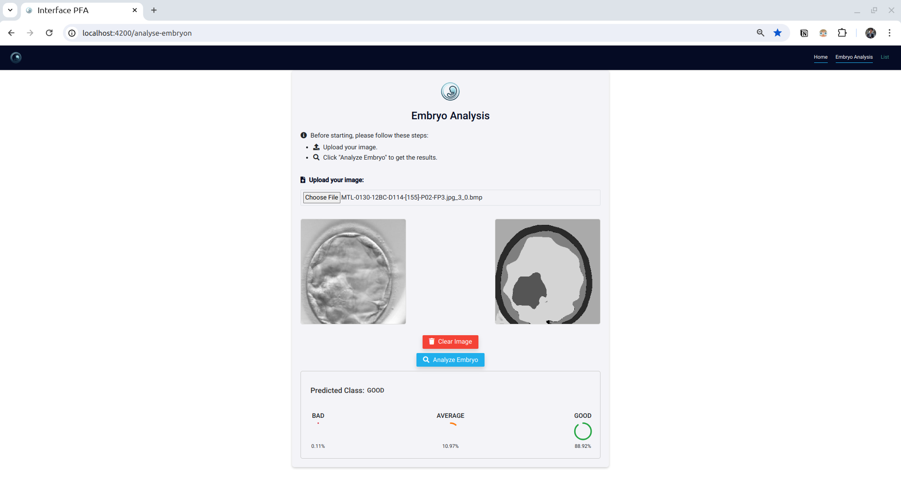

# About the project:
This an deep learning solution to help professional embryologist analyze embryos during their early stages throughout the In Vitro Fertilization IVF process. 

The main idea was about constructing a Deep Learning model capable of recognizing the different zones of the embryo image, evaluating each zone separately, and thereby classifying the overall embryo 

# Technologies:

## Image segmentation:
For the segmentation part, we Implemented the DenseNet121 UNet architecture, which is quite efficient in segmentation due to its encoder-decored architecture 

## Image classification:
For the classification part, we implemented the Xception neural network, which is renowned for its performance in image classification tasks.

## Platform:

To make our work concrete, we developed a user-friendly platform, enabling users to upload embryo images, and in a matter of few seconds, predictions from the deep learning models would be sent back and displayed in a user-friendly UI.

For the tech stack, we used Angular to build the front end and Flask API to develop the APIs.

Leveraging Microsoft Azure, we ensured that our data would be safely persisted using Blob storage for storing embryo images and Azure SQL Database for storing the respective model's predictions

# Overview:

<!-- ## Run the project
### Run the frontend:
- run **npm install** to install the node packages
- run **ng serve** to serve the angular application  

### Run the backend:
- go to the **backend** directory
- run **python3.10 -m pip install requirements.txt**
- run **python3.10 app.py**

I upl -->

